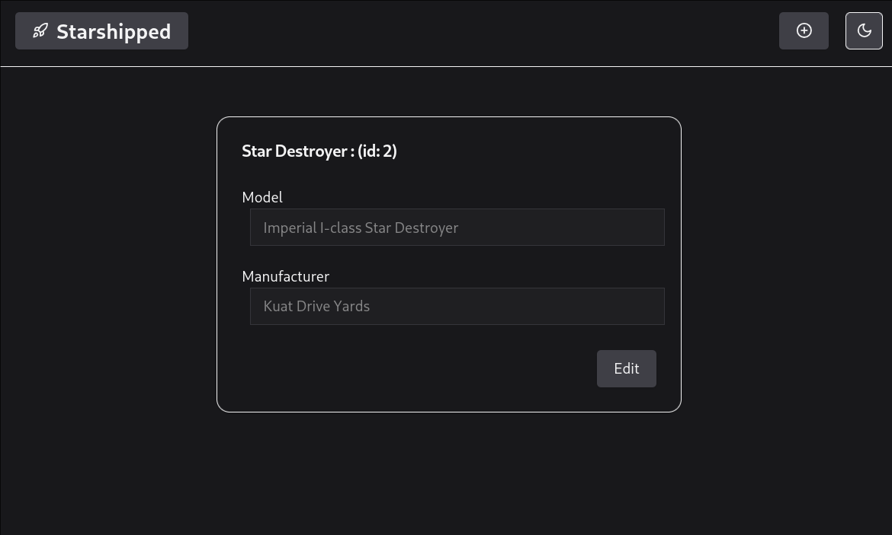

# Starshipped


## Goals 

- Create __.Net 8__ SPA API
- Create __SQL Server__ database and Connect using _Entity Framework Core_
- Create a __React__ SPA 
- Integrate Data from SWApi
- Fly Starships?

## Running the application

The best way to run everything is with three commands

1) Run the docker-compose at the rootlevel
```sh
> @/Starshipped
docker compose up --build
```
This will run the database and frontend.
These applications are accessible at `localhost:1433` & `localhost:3000` respectively.


2) Init the database connection with EF
```sh
> @/Starshipped/backend
dotnet ef database update
```
If you don't have dotnet-ef installed, you can install it via `dotnet tool install --global dotnet-ef`.

3) Run the CSharp Backend
```sh
> @/Starshipped/backend
dotnet run
```
This will expose the application at `localhost:5199`



## Architecture

### Backend (minimal .Net WebApi)
I'm not a huge fan of all the magic that C# goes to at scale, even though in most cases its really great.
As such, I decided to use the minimal webapi that comes with `dotnet new webapi`. This scaffolds an extremely
spartan starting point in the Program.cs toplevel. Because this application will be very basic, this works great.

In the future, there is a lot more architecture work to be done here. Rather than adding all the endpoints,
there should be individual controllers for the endpoints, each of which use the declarative controller syntax. 
Also, there should be some work to be done on helping to architect the database at scale.

### Database (SQL Server)
It's been a minute since I've setup a database, and because I'm running this on my linux machine, containerizing
the database with Docker is my best and only option for making this work quickly and effectively. This portion of 
the code is both the simplest to set up, and the easiest to move to any other db application.

### Frontend (React)
From the few different frontend frameworks / tooling setups, Vite was the simplest and least tempermental. 
I set this up to use React & Typescript & Tailwind. I chose to use [shadcn](https://ui.shadcn.com) as my ui library, as I'd 
seen some cool stuff about using it, and I took this opportunity to learn something new. This was a great addition, 
as it exposes a `npx` cli that copies in the components as tsx into your components lib. This, combined with TailwindCSS
allows for a really nice looking ui with a lot of flexibility.

## Tooling

For this project, I developed on my personal laptop. Because this machine runs linux, getting `dotnet` to run 
was a bit of a struggle, but we perservere. This, however, is the reason for me to dockerize this project and 
to try to use cross-platform tech.

Due to some unforseen circumstances, I didn't really get very much time to work on the project. 
For this reason, I decided it was a good idea to use some force multipliers, I want to be upfront about the 
resources that I used, and where I used them. 
I used AI in this project for 2 main purposes, for configuration, and for initial setup. For configuration, 
I used ChatGPT, this was mainly for generating dockerfiles, getting some frontend configuration fixed, and 
for generating a fixed global tailwind css theme. For initial setup on the Frontend UI, I used [V0_Dev](https://v0.dev) 
which is a chat app that can generate React UI code. It's not for making anything complicated, but more to give a good
starting point for a ui.


